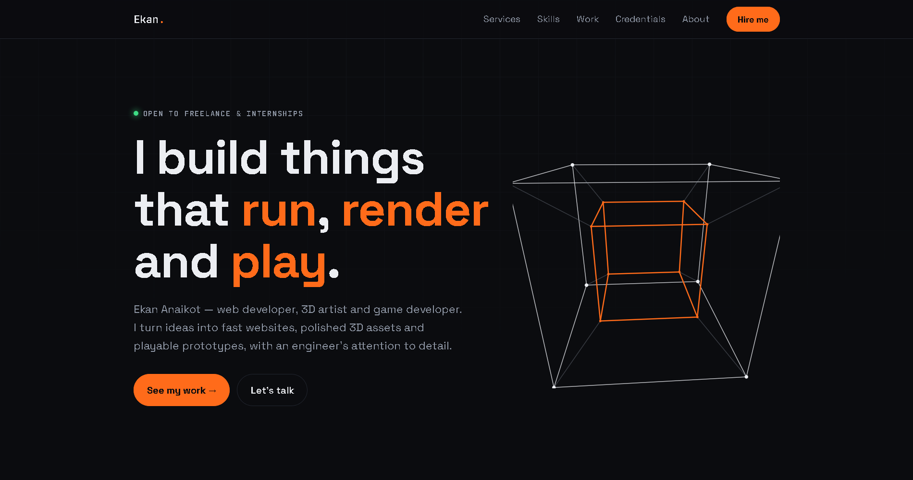

# Ekan Anaikot | Portfolio

Personal portfolio of **Ekan Anaikot**: web developer, 3D artist and game developer
based in Uyo, Nigeria. A fast, single-page site with an interactive skill tree,
a robotics-themed education timeline and a hardware-module certification rack.

**Live site:** [(https://uniek23.github.io/my_portfolio/#)]



## Highlights

- **Hero:** a 3D wireframe cube drawn on canvas that follows the mouse
- **Skill tree:** a game-style tree for Web, 3D Art, Games and Robotics. Tap a node
  to open its Quest Log with the level and description
- **Mission path:** education shown as a route, with a robot that moves as you scroll
  and progress cells calculated from each programme's dates
- **Installed modules:** certifications styled as hardware chips, with a "loading"
  slot for the next one
- **Copy-email button**, scroll-reveal animations and a mobile layout with even gutters
- Respects `prefers-reduced-motion`
- No frameworks, no build step, no dependencies

## Tech

HTML, CSS and vanilla JavaScript. Fonts: Space Grotesk and JetBrains Mono (Google Fonts).

## Project structure

```text
portfolio/
├── index.html      # markup, styles and scripts in one file
└── images/
    └── ekan.png    # portrait used in the About section
```

## Contact

- Email: <ekananaikot@gmail.com>
- LinkedIn: [linkedin.com/in/ekan-anaikot-8a0623337](https://linkedin.com/in/ekan-anaikot-8a0623337)
- GitHub: [github.com/UniEK23](https://github.com/UniEK23)
- ArtStation: [artstation.com/ekanastra](https://www.artstation.com/ekanastra)

## License

© [2026] Ekan Anaikot. All rights reserved.
